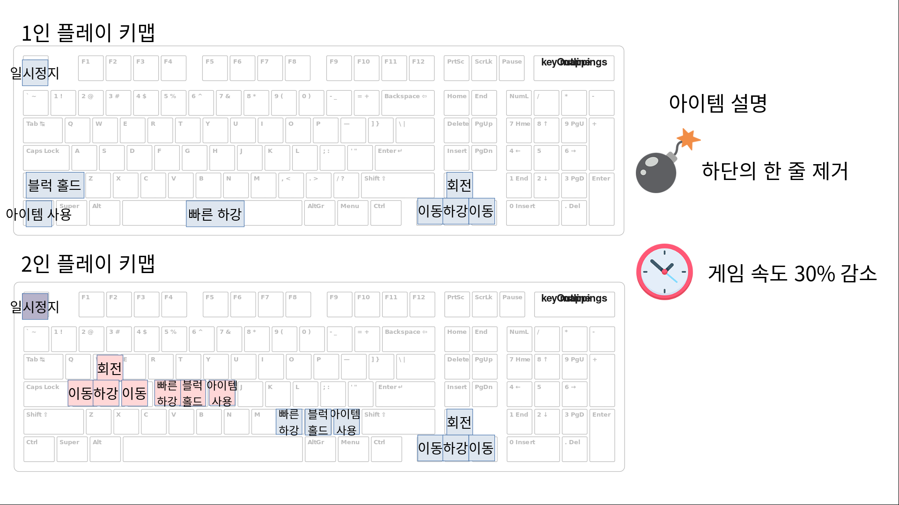

# 2021-2-OSSProj-OTS-7
온라인 테트리미노(like Tetris) 게임. 

클라이언트, 멀티플레이어 서버, 웹으로 구성된 프로젝트입니다.
## Teams OTS
#### 법학과 2016110652 김성현 https://github.com/kshshkim
#### 불교학부 2016110061 유동안 https://github.com/daryu519
#### 산업시스템공학과 2017112546 소준용 https://github.com/jjunyong-e
 

# Client

### Info

[PYTRIS](https://github.com/injekim/PYTRIS)의 포크로, 버그 수정과 기능 추가 사항이 있습니다.

## How to play
바이너리 배포 예정입니다.

### Key Map

### Item
 
 
Erase the last line
 

 
Slow down the speed of the block
 
